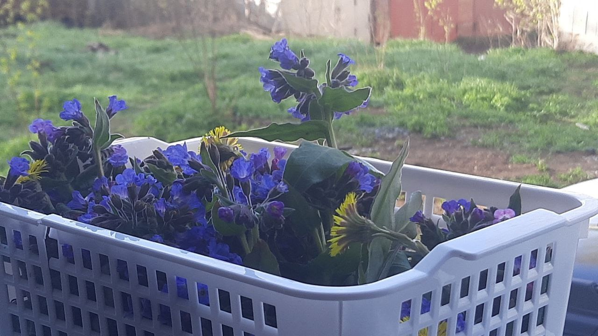

Здесь собираю информацию по проекту попутного пчеловодства. Не обязательно оформлять землю в собственность, можно сделать ульи и поставить их по пути из дома на работу, на той тропе, где собираю малину и где растёт Иван-Чай.  Да, Иван-чай (кипрей узколистный) является отличным медоносом. Он обильно выделяет нектар, особенно в период цветения, привлекая пчел. Считается, что с гектара сплошных зарослей кипрея можно получить от 300 до 600 кг меда, по данным Доброго пасечника.

Второй вопрос: какую конструкцию ульев сделать?

https://www.eco-kovcheg.ru/think3.html

Видно что улей должен стоять в сухом месте, возвышаться над землёй. Канализационные трубы думаю излишние, попробую сделать по классике, как Лазутин.

https://www.eco-kovcheg.ru/shop2.html - здесь примеры ульев, а это .